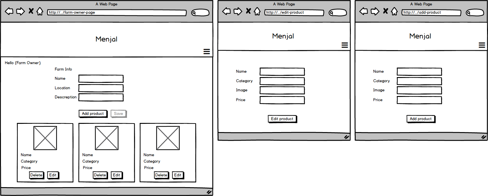
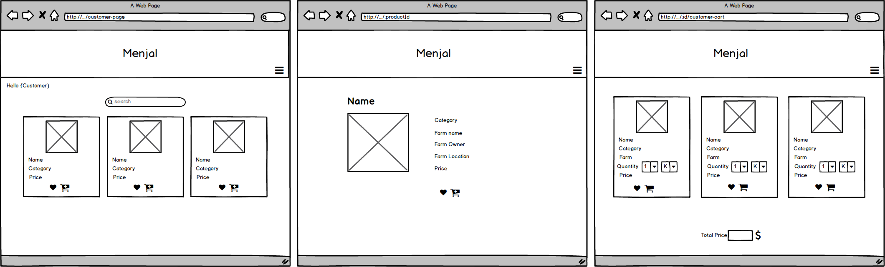

# Menjal

Application for farms, where customer can buy directly from the farm and show a brief description of the history of the farm and its profitable location.
 
## Description
Menjal is application that enables farmers to reach buyers. It has two types of user: 
- Farm owner: The owner can sell his products and view a brief description about his farm.
- customer :Can see products from all farms, buy and prefer products.

### Technical Used
Manjel is MERN stack application that utilize MongoDB, Express, React, and Nodejs.
- MongoDB
- Express
- React
  - Bootstrap for react
- Nodejs
  - Ajax (axios) for API

### Wireframes

### Data Model

### User Stories
There are two types of user:
1. Farm owner:
- Farm owner able to add Products
- Farm owner able to edit the Products
- Farm owner able to view all Products
- Farm owner able to view a single Product
- Farm owner able to edit or delete Products
2. Customer
- Customer able to view all Products
- Customer able to view a single Product
- Customer able to look for a specific product
- Customer able to add Products to cart 
- Customer able to add Products to Favorite

## Planning and Development Process

1- Discuss ouer ideas with an instructor and get it approved.

2- Draw  wireframes covering all views we  might need.

3- Agree on ouer project data model (schemas and relations).

4- Set up our team organization repo by the end of the day.

