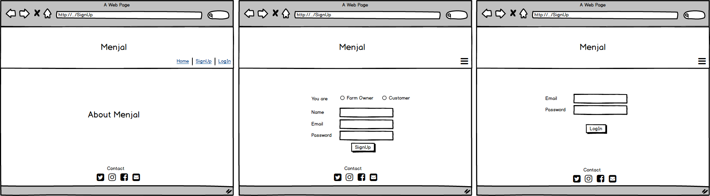

# Menjal
Menjal is a website application for farms inside Saudi Arabia, where the customer can buy directly from any local farm that exports dates, grain products, vegetables, and fruits with having the ability to show a brief description of that farm and its profitable location.
This website has been developed in partial fulfillment of the requirements for the third Project of **Software Engineering Immersive Course**, that provided by **_General Assembly Middle East_ & _Misk Academy_**.
 
## Technical Used
Manjel is a MERN-stack application that utilizes MongoDB, Express, React, and Nodejs.
* MongoDB
* Express
* React
  * Bootstrap for react
* Nodejs
  * Ajax (axios) for API

## Wireframe

## Data Model

## Users Stories
Menjal Website has two types of users:
1. **_Farm Owner_:**
* Able to add Products
* Ale to edit the products
* Able to view all products
* Able to view a single product
* Able to edit/delete the products
2. **_Customer_:**
* Able to view all products
* Able to view a single product
* Able to search about a specific product
* Able to add products to cart (buy it)
* Able to add products to Favorite-List

## Website Live-Demo
[https://menjal.herokuapp.com/]

## Developed By
Njoud Haddad, Fidaa Alshaikh, Mariam Ghazwani, and Mashael Almutiri.

